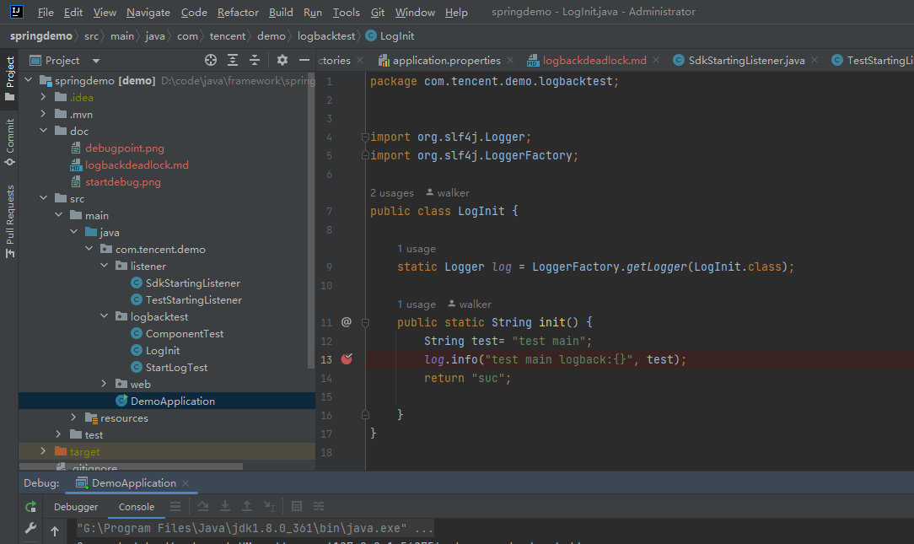
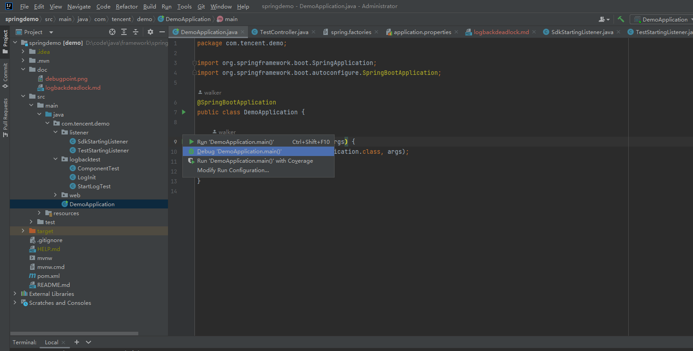
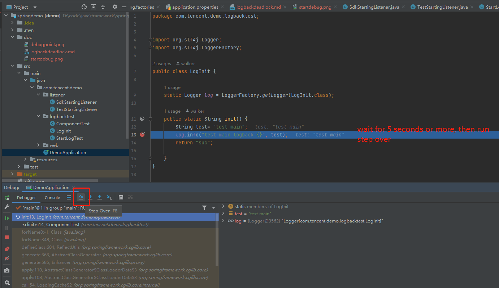
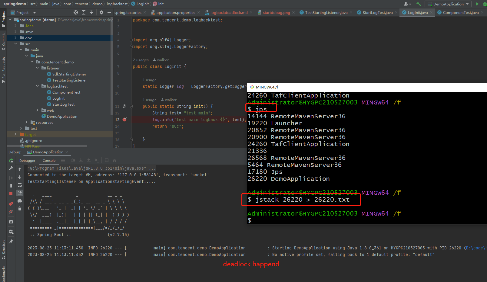
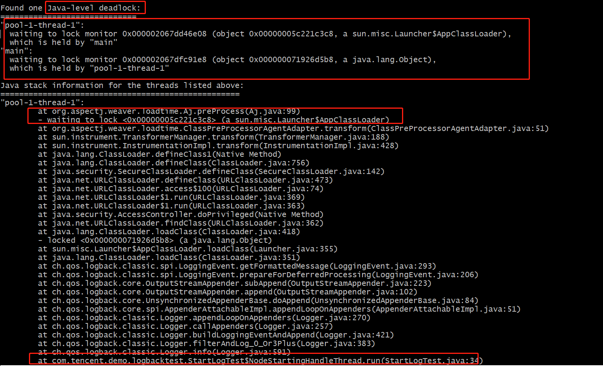

# how to reproduce the deadlock
* add a debugpoint

* start the application in debug mode

* wait for 5 seconds or more, and then run debug next line

* the application will be deadlocked

* the thread dump will show the deadlock

```agsl
* as you can see, the thread `main` and the thred `pool-1-thread-1` are deadlocked for log info format message.
* aspectj weaver is needed for our project.
```

[jstackInfo](26220.txt)

# how to fix the deadlock
I don't know how to fix this problem, wish your response.
